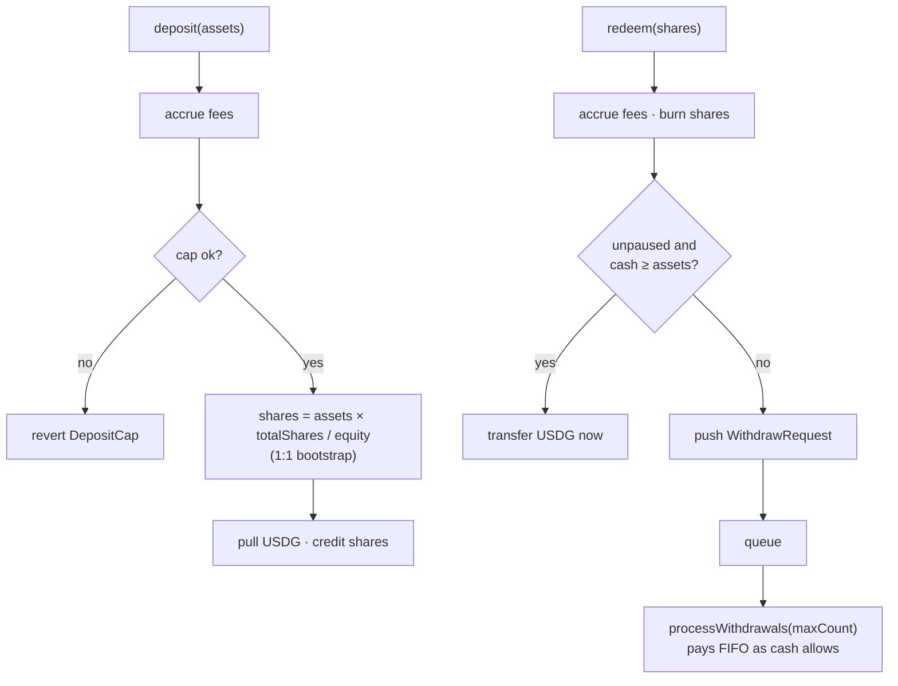

## Deposits

`deposit(assetsUsdg)`:

1. Accrues fees (so the new depositor doesn't dilute existing fee liabilities).
2. Enforces the deposit cap: `depositCapUsdg != 0 && equity + assets > cap` reverts `DepositCap`. Mainnet desks cap at 50,000 USDG of post-deposit equity; testnet is uncapped (`0`).
3. Mints shares: `shares = assets × totalShares / equity`, or **1:1** when the desk is empty. Zero-share results revert.
4. Pulls USDG, credits `cashUsdg`, `totalShares`, `sharesOf[sender]`; touches the high-water mark; attempts fee payout.

Deposits require the vault to be unpaused.

## Redemptions

`redeem(shares)` burns shares and owes the user `shares × equity / totalShares` USDG. What happens next depends on cash and pause state:

| Vault state | Outcome |
|---|---|
| Unpaused, `cashUsdg ≥ assets` | **Instant** — USDG transferred in the same transaction |
| Paused, or cash short | **Queued** — a `WithdrawRequest { user, assetsUsdg, fulfilled }` is appended; `WithdrawQueued` emitted |

Note the deliberate property: **pausing never traps shares.** A paused vault still accepts redeems; they just queue for cash instead of paying instantly.

## The withdrawal queue

- FIFO, indexed by `queueHead`; requests are never reordered or cancelled by the protocol.
- `processWithdrawals(maxCount)` — callable by **anyone**, only while unpaused — pays requests in order while cash covers them, marking each `fulfilled` and emitting `WithdrawFulfilled`. It stops at the first request that exceeds available cash (no partial payments).
- Cash arrives from deposits and from sell-side copies, so a queued withdrawal is paid when the desk next holds enough free USDG.
- `withdrawQueueLength()` exposes the queue size; the queue itself is public storage.

## Deposit/withdrawal flow

## Worked example

Example numbers — not a live desk or forecast. Desk at NAV/share 1.09 after fees, holding 8,000 USDG cash:

- A 5,000-share redeem owes `5,000 × 1.09 ≈ 5,450 USDG` → paid instantly (cash covers it).
- A further 10,000-share redeem owes ≈ 10,900 USDG against ≈ 2,550 remaining cash → queued, and paid by `processWithdrawals` after the desk sells positions.
