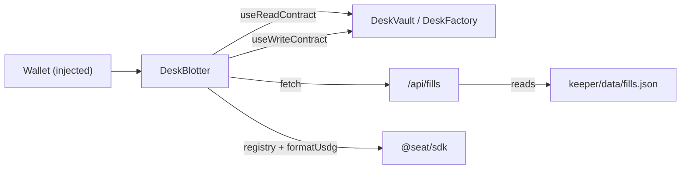

**Responsibility.** Give depositors and observers a truthful window into desks: NAV, shares, cash, leader, fill tape — plus deposit/redeem/stake/list transactions. **Package:** `app/` (`@seat/app`). Full docs in the [Application section](/docs/application/overview).

## Structure

| Piece | File | Job |
|---|---|---|
| Page | `app/src/app/page.tsx` | Renders `DeskBlotter` (the only screen) |
| Blotter | `app/src/components/DeskBlotter.tsx` | All desk reads/writes, desk picker, tape |
| Providers | `app/src/components/Providers.tsx` | wagmi + react-query |
| Chain config | `app/src/lib/wagmi.ts` | `defineChain` for 4663/46630, injected connector, SSR |
| Addresses | `app/src/lib/addresses.ts` | Generated per-chain contract addresses; `canWriteOnChain` |
| Paper data | `app/src/lib/desks.ts` | Clearly-labelled test desk for the fallback UI |
| Fills API | `app/src/app/api/fills/route.ts` | Serves `keeper/data/fills.json` |
| ABIs | `app/src/abis/` | Extracted from Foundry `out/` (never hand-written) |

## Data flow

- **Reads:** `leader`, `totalAssetsUsdg`, `totalShares`, `cashUsdg`, `navPerShare`, `sharesOf`, plus factory `deskCount`/`allDesks` for the picker.
- **Writes:** `approve` + `deposit`, `redeem`; Phase 2 adds stake and list-desk forms when `seatToken` is wired. Writes are gated by `canWriteOnChain(chainId, addresses)` — a chain must be Robinhood (4663/46630) **and** have a non-null vault.
- **Fallback:** with no wallet on a Robinhood chain, or no vault wired, the blotter renders the paper desk — test data, labelled as such, never presented as live.

## Configuration

`NEXT_PUBLIC_RH_TESTNET_RPC_URL` / `NEXT_PUBLIC_RH_RPC_URL` / `NEXT_PUBLIC_CHAIN_ID`. Placeholder hosts keep the app type-checking when unset. Contract addresses come from `scripts/write-addresses.ts` after real broadcasts — hand-editing invented addresses is explicitly prohibited by the file's own header.

## Failure modes

| Case | Behaviour |
|---|---|
| No vault on connected chain | Paper blotter fallback |
| Factory read fails | Falls back to the single wired vault address |
| `fills.json` missing | `/api/fills` returns an empty list |
| Wrong chain | Writes disabled; testnet assumed for reads |
