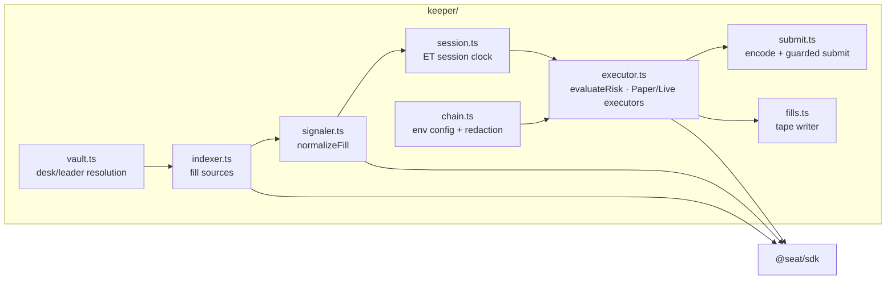

**Responsibility.** Turn leader trading activity into well-formed, risk-checked `executeCopy` submissions — and produce an honest tape of every decision. The keeper has no custody and no discretion beyond the rules it implements.

This page is the structural view; the operational view is in the [Keeper section](/docs/keeper/overview).

## Module map

## Design properties

- **Zero framework dependencies.** The keeper depends only on `@seat/sdk` and `tsx` (dev). Chain access is raw JSON-RPC `fetch` calls — no ethers/web3.
- **One pipeline, two sources.** `StaticFillSource` (fixtures) and `LiveFillSource` (chain logs) feed the *same* normalize → risk → execute path, so paper mode exercises the real logic.
- **Fail-closed live path.** `LiveExecutor` refuses non-Robinhood chains, refuses without a configured router, and refuses non-eligible symbols. `submitExecuteCopy` additionally requires `DESK_ADDRESS` + RPC + `PRIVATE_KEY`, a registry address, and `SEAT_SUBMIT_TX=1` — otherwise it throws a dry-run error containing the calldata it *would* have sent.
- **Honest labelling.** Tape rows carry `source=fixture` or `source=chain`; fixtures are never labelled live. Config logging redacts URLs and never prints keys (`redactChainConfig`).
- **The keeper never picks a leader.** Resolution order: `DESK_ADDRESSES` → `DESK_ADDRESS` → factory `allDesks` → `LEADER_ADDRESS` fallback → `unbound` (paper-only).

## Shipped configuration (`keeper/src/index.ts`)

| Setting | Value |
|---|---|
| `baseCopyBps` | 500 (5% of leader notional) |
| `maxFillUsdg` | 2,000 USDG |
| `maxPositionUsdg` | 5,000 USDG |
| `maxGrossExposureUsdg` | 10,000 USDG |
| `maxDrawdownBps` | 2,000 (20%) |
| `maxStalenessSec` | 120 |
| Static market | NVDA @ 120 USDG, 25 bps simulated slippage |
| Seed state | 10,000 USDG cash, 10,000 shares |

These are the *keeper-side* paper parameters. The on-chain desk caps are configured separately in `RiskModule` (mainnet defaults: 5k/20k/50k). Both layers are documented in [Risk → Parameters](/docs/risk/parameters).

## Failure modes

| Case | Behaviour |
|---|---|
| RPC unreachable | `LiveFillSource` returns an empty tape (never invents history); desk resolution falls back to `LEADER_ADDRESS` |
| `LiveExecutor` constructor guards fail | Keeper logs a warning and falls back to paper for that desk |
| Submit guards unmet | Dry-run throw with encoded calldata; outcome recorded with the error as its reason |
| Held position loses its price | Paper equity computation throws; `safeEquity` falls back to cash-only for the tape |

## Interactions

Reads `@seat/sdk` for the registry and NAV math; writes `keeper/data/fills.json`, which the app serves at `/api/fills`; submits to `DeskVault.executeCopy` when fully unguarded.
