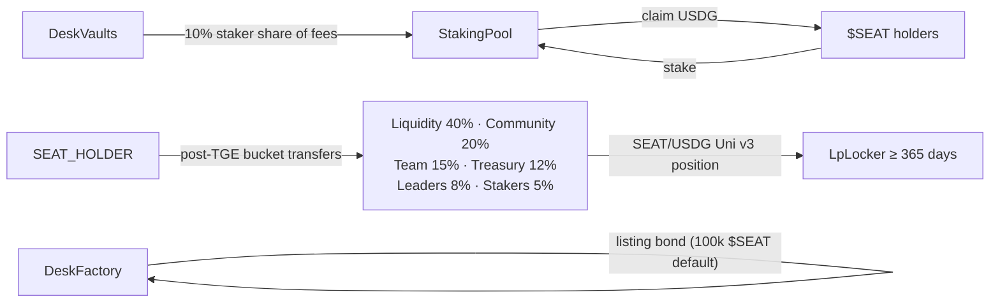

:::callout{type="experimental" title="Phase 2 — code shipped, not deployed"}
All three contracts are implemented and unit-tested, but **no `$SEAT` token, staking pool, or LP locker exists on any network today.** They deploy only via the dual-confirmed `DeployPhase2` script. Do not assume a `$SEAT` contract address exists; none is recorded anywhere in the repository.
:::

## SeatToken

**Contract:** `contracts/src/SeatToken.sol` — reference: [SeatToken](/docs/contracts/seat-token).

A plain OpenZeppelin ERC-20 (`SEAT` / `SEAT`, 18 decimals) with the entire supply — `1_000_000_000e18` — minted once to `initialHolder` in the constructor. **There is no mint function.** Bucket allocations (liquidity 40%, community 20%, team 15%, treasury 12%, leader incentives 8%, staker bootstrap 5%) are *post-TGE owner transfers*, not constructor magic — the deploy script deliberately does not invent bucket addresses.

## StakingPool

**Contract:** `contracts/src/StakingPool.sol` — reference: [StakingPool](/docs/contracts/staking-pool).

Stake `$SEAT`, earn pro-rata USDG from desk fee harvests. Classic accumulator design (`accUsdgPerShare` with 1e18 precision, per-user `rewardDebt`):

- Desks push the staker fee slice via `notifyReward(amountUsdg)`, which pulls USDG from the vault and folds it into the accumulator.
- Rewards that arrive with zero stakers are held as `undistributedUsdg` and fold in when staking resumes — they are not lost and not redirected.
- `stake` / `unstake` / `claim` settle pending rewards before moving balances. No rebase, no vote-to-print.

## LpLocker

**Contract:** `contracts/src/LpLocker.sol` — reference: [LpLocker](/docs/contracts/lp-locker).

Holds one Uniswap v3 position NFT for **at least 365 days** (`MIN_LOCK`). The owner locks with `lock(nft, tokenId, duration, beneficiary)`; `withdraw()` works only after `unlockTime` and sends the NFT to the beneficiary. The cited NonfungiblePositionManager on 4663 is `0x73991a25C818Bf1f1128dEAaB1492D45638DE0D3`. Seeding the SEAT/USDG pool is a **manual owner transaction** — the deploy script logs "seed+lock later" and never mints a position itself.

## How the suite connects

## Failure modes

| Case | Behaviour |
|---|---|
| `stake(0)` / `unstake(0)` / `notifyReward(0)` | `ZeroAmount` |
| Unstake more than staked | `stake` revert |
| `LpLocker.lock` with duration < 365 days | `TooShort` |
| Second lock | `AlreadyLocked` |
| Early withdraw | `StillLocked` |
