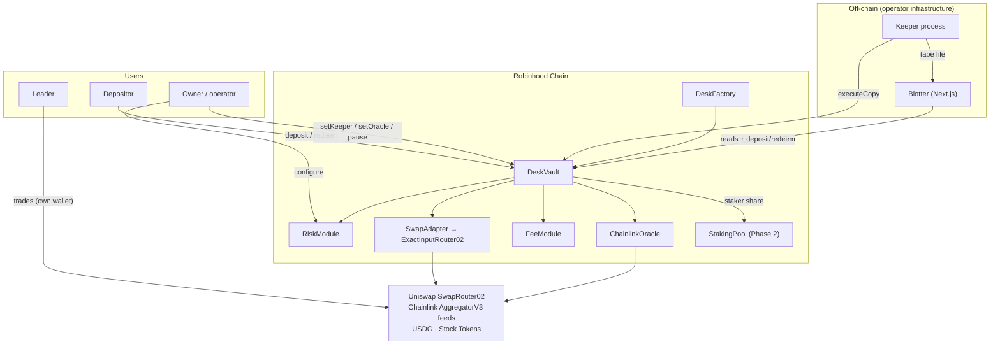

## Composition

## Data flows

There are two deliberately separate flows:

| Flow | Path | Carries |
|---|---|---|
| **Signal** | leader wallet → chain logs → keeper → risk evaluation | Information about trades |
| **Capital** | depositors → DeskVault → SwapAdapter → DEX → positions → depositors | USDG and Stock Tokens |

The leader never enters the capital path. The keeper touches capital only through the single `executeCopy` entry point, which is itself gated by the on-chain risk module.

## Layers and their trust

| Layer | Components | Trust assumption |
|---|---|---|
| Funds custody | `DeskVault` | Non-upgradable contract; owner can pause and configure but cannot withdraw user funds |
| Decision | `RiskModule` | Pure, deterministic, owner-configured |
| Execution | `SwapAdapter` + router | Restricted surface; no arbitrary calldata; reverts without a configured router |
| Observation | Keeper | Single operator; can only *propose* copies — the vault re-verifies |
| Pricing | `ChainlinkOracle` + Chainlink feeds | External data dependency with staleness bounds |
| Presentation | App + SDK | Read-mostly; writes go straight to the contracts |

## Dependency map (code level)

- `DeskVault` → `IRiskModule`, `ISwapAdapter`, `IPriceOracle` (NavLib), `FeeModule`, `IStakingPool`, OpenZeppelin (`Ownable`, `Pausable`, `ReentrancyGuard`, `SafeERC20`)
- `DeskFactory` → deploys `DeskVault`; `IERC20` for the `$SEAT` bond
- `SwapAdapter` → `IExactInputRouter`; `ExactInputRouter02` → `ISwapRouter02` (Uniswap)
- `ChainlinkOracle` → `AggregatorV3Interface`
- keeper → `@seat/sdk` (registry, NAV math, chain constants)
- app → `@seat/sdk`, wagmi/viem, ABIs extracted from Foundry `out/`

## Failure isolation

- Keeper down → no new copies; funds unaffected. ([details](/docs/operations/failure-modes))
- Oracle stale/missing → valuation reverts; copies rejected; deposits/withdrawals that need pricing revert.
- Router unset → `SwapAdapter.execute` reverts; the vault cannot trade at all.
- Owner key compromise → worst case is pause + misconfiguration, not fund theft (no owner withdrawal path exists). See [Security](/docs/security/security-model).
