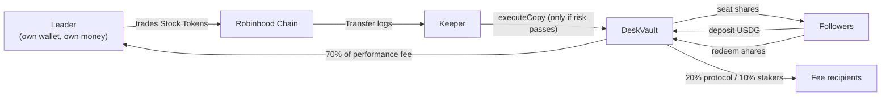

## Leaders

**Plain English.** A leader is a trader whose Stock Token activity a desk copies. Leadership is explicit: the protocol owner chooses leader addresses when deploying desks, and a leader's address is bound into their desk's vault forever. Leaders never touch depositor funds; they are compensated with the majority share of performance fees.

**Technically.**

- The binding is the immutable `leader` address set in the `DeskVault` constructor. `DeskFactory` enforces one vault per leader (`deskOf` mapping, `DeskExists` error).
- Bootstrap desks are created by the owner via `createDesk(leader)`. After Phase 2 TGE, anyone can permissionlessly create a desk for a leader via `listDesk(leader)` by posting the `$SEAT` listing bond (default `100_000e18`, configurable at `setListingParams`).
- The leader receives the leader share of fees at `leaderFeeRecipient`, which defaults to the leader address itself and can be redirected by the owner via `setFeeRecipients`.
- The keeper reads the binding from chain (`vault.leader()`); an operator can override observation with `LEADER_ADDRESS`, but the vault's executed copies are always for its immutable leader's desk.

**What a leader cannot do:** withdraw from the vault, call `executeCopy` (that is the keeper's exclusive surface), change risk parameters, or unblock a drawdown halt.

## Followers (depositors)

**Plain English.** A follower deposits USDG into a desk and receives seat shares. From that moment, their money participates in every copy the desk makes — gains and losses — proportional to their share count. They can redeem shares for USDG at the current NAV per share, instantly when the vault has cash, otherwise via a queue.

**Technically.**

- `deposit(assetsUsdg)` mints shares pro-rata to equity (`NavLib.sharesForDeposit`); the first deposit into an empty desk bootstraps 1:1.
- `redeem(shares)` burns shares and pays `NavLib.assetsForRedeem` — instantly if the vault is unpaused and `cashUsdg` covers it, otherwise the request is queued (`WithdrawQueued`) and paid by `processWithdrawals` as cash becomes available.
- A desk may have a **deposit cap** (`depositCapUsdg`); mainnet desks are capped at 50,000 USDG of equity after each deposit. `0` means unlimited (the testnet configuration).
- Followers take market risk on the desk's positions and pay the fees described in [Fees & High-Water Mark](/docs/concepts/fees-and-high-water-mark).

## The relationship in one diagram

Full step-by-step walks: [Leader journey](/docs/journeys/leader-journey) and [Depositor journey](/docs/journeys/depositor-journey).
