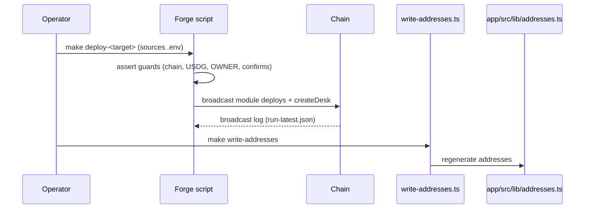

Deployment is Foundry scripts in `contracts/script/`, driven by Makefile targets. There are exactly three scripts, each with a distinct posture:

| Script | Target | Guards | Posture |
|---|---|---|---|
| `DeployTestnet.s.sol` | 46630 | none beyond a key | Cash vault, **no router ever**, never deploys SeatToken |
| `DeployMainnet.s.sol` | 4663 | `CONFIRM_MAINNET=I_UNDERSTAND` | Capped desk (50k USDG), no router, no TGE |
| `DeployPhase2.s.sol` | 4663 | `CONFIRM_MAINNET` **and** `CONFIRM_SEAT_TGE=I_UNDERSTAND` | TGE (`SeatToken`, `StakingPool`, `LpLocker`), extra desks, staker fee wiring |

:::callout{type="danger" title="Production readiness"}
SEAT is **not production-ready**. Mainnet scripts have never been broadcast; the system is unaudited; the live fill path has a known indexer limitation. Treat every deployment as an experiment. See [Security](/docs/security/security-model).
:::

## Common flow



## What every script deploys

1. `NavLib` (library), `FeeModule`, `RiskModule`, `ChainlinkOracle` (mainnet only), `SwapAdapter`.
2. `DeskFactory` wired to those modules.
3. One bootstrap desk via `factory.createDesk(leader)` — the vault is created by the factory, not deployed directly.
4. Risk parameters applied via `configureDesk` (mainnet only; testnet keeps constructor defaults).

## Verification

The scripts do not run an explorer verification step. After deploy, confirm with `cast`:

```bash
cast call $DESK_FACTORY "allDesks(uint256)(address)" 0 --rpc-url $RPC
cast call $DESK "navPerShare()(uint256)" --rpc-url $RPC
```

(Exact function selectors per the contract sources — see [Contracts](/docs/contracts/overview).)
