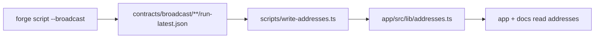

Addresses are never hand-edited into the app. `scripts/write-addresses.ts` reads Foundry broadcast logs and regenerates `app/src/lib/addresses.ts`.

## Flow



## Usage

```bash
make write-addresses
```

- Reads the newest `run-latest.json` per chain under `contracts/broadcast/`.
- Maps deployed contract names to the address table; unknown chains are skipped.
- Writes both `4663` and `46630` sections; undeployed entries stay `null`.

## Rules

1. **Commit the regenerated file.** It is the single address source of truth for the app and this documentation.
2. **Never paste addresses by hand** into `addresses.ts` — regenerate from a broadcast log so every address is traceable to a transaction.
3. **Never copy 4663 addresses onto 46630** (the registry's placeholder rows exist to prevent exactly this).
4. If a deploy is partial, rerun the script after completing it — `null` entries are the honest state, not an error.

## Verifying an address independently

```bash
# the address must trace to a real deployment transaction
cast tx <deploy-tx-hash> --rpc-url $RPC

# and the code at the address must be non-empty
cast code <address> --rpc-url $RPC
```
