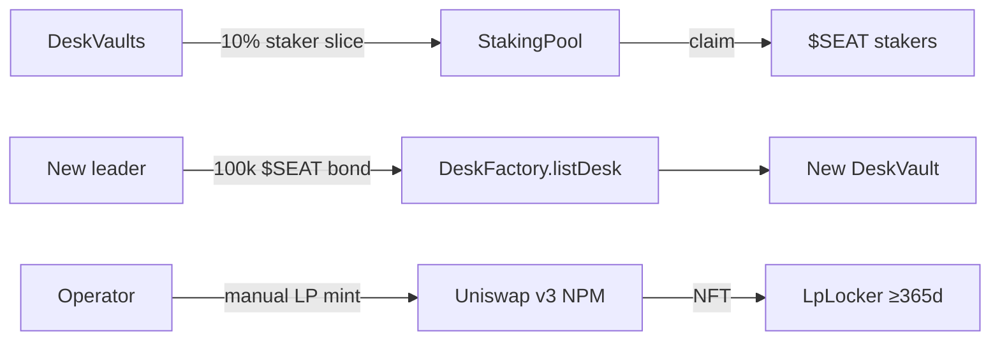

::status{value="planned"}

All three mechanisms are implemented and tested, and all three are **undeployed** — they activate with the [Phase 2 deployment](/docs/deployment/phase-2).

## StakingPool

- Stake `$SEAT`, earn a share of desk fees (the 10% staker slice of performance + AUM fees).
- Rewards track an `accUsdgPerShare` accumulator: deposits of USDG rewards increase the accumulator; each staker's pending reward is `staked × (accPerShare − userDebt)`.
- Rewards that arrive while **nobody is staked** land in `undistributedUsdg` and fold into the accumulator when staking resumes — they are not lost and not skimmed.
- `stake` / `unstake` / `claim` are the full interface. No lockup, no slashing.

## Listing bond (stake-to-list)

- `DeskFactory.createDesk` is owner-only (curated desks).
- `DeskFactory.listDesk` is **permissionless** but pulls a `$SEAT` bond — default `100_000e18` — from the caller.
- `returnBond` returns the bond. The bond is anti-spam, not a fee: it is not revenue and is not burned.
- One vault per leader address, always.

## LpLocker

- Holds a Uniswap v3 position NFT (the SEAT/USDG liquidity position) for **≥ 365 days**.
- Early withdrawal reverts; after the lock, only the beneficiary can withdraw.
- The cited NPM is `0x73991a25C818Bf1f1128dEAaB1492D45638DE0D3` on 4663; the mint itself is a manual operator step — the deploy script only logs intent.

## How the pieces interact

## Honest status

| Mechanism | Code | Tests | Deployed |
|---|---|---|---|
| StakingPool | ✅ | ✅ | ❌ |
| Listing bond | ✅ | ✅ | ❌ (factory on 46630 predates it) |
| LpLocker | ✅ | ✅ | ❌ |

Until Phase 2 ships, none of these economics exist on-chain. Treat any claim otherwise as fraudulent.
