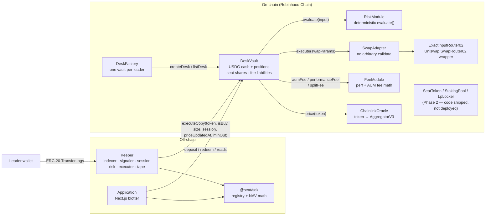

SEAT is a monorepo of four deployable parts plus shared documentation. This page is the map; each component has a full page in [Protocol Architecture](/docs/architecture/system-overview) and a reference page in [Smart Contracts](/docs/contracts/overview).

## System diagram

## The four parts

### Contracts (`contracts/`)

Solidity 0.8.28, Foundry, OpenZeppelin. The vault holds depositor funds; the risk module decides; the swap adapter executes; the fee module computes; the factory deploys one vault per leader. Everything the money touches is here. [Start with the contracts overview →](/docs/contracts/overview)

### Keeper (`keeper/`)

A TypeScript process with no framework dependencies beyond `@seat/sdk`. It observes leader fills, normalizes them, applies the same risk rules off-chain, executes paper copies by default, and only submits on-chain transactions when a strict set of live guards pass. [Keeper →](/docs/keeper/overview)

### Application (`app/`)

A Next.js 14 + wagmi front end — the **desk blotter**. It reads NAV, shares, cash and the leader from the vault, writes deposits and redeems, and serves the keeper's fill tape at `/api/fills`. When the connected chain has no vault, it falls back to an honestly-labelled paper desk. [Application →](/docs/application/overview)

### SDK (`sdk/`)

`@seat/sdk` — two responsibilities: the **official Stock Token registry** (verification states, per-chain rows, trade-eligibility) and **fixed-point NAV math** that mirrors the on-chain `NavLib`. Keeper and app both consume it, so there is one definition of "eligible asset" and one definition of "NAV". [SDK →](/docs/sdk/installation)

## Design rules you will see everywhere

- **Fail closed.** Unknown asset, stale price, undeterminable session, breached cap — all resolve to "do not trade", on-chain and off-chain.
- **No invented addresses.** Token, feed and router addresses are only ever cited from authoritative sources; missing facts keep features closed rather than guessed.
- **One leader per desk.** Fixed at deployment; the keeper never chooses.
- **NAV uses `balanceOfUI()`,** never raw `balanceOf`, for Stock Token balances.
- **No volume fee.** Fees are profit-above-high-water plus a time-based AUM fee.
- **Guarded mainnet.** Broadcasting to mainnet `4663` requires explicit `CONFIRM_MAINNET=I_UNDERSTAND`; the Phase 2 TGE requires a second confirm. See [Deployment](/docs/deployment/overview).
