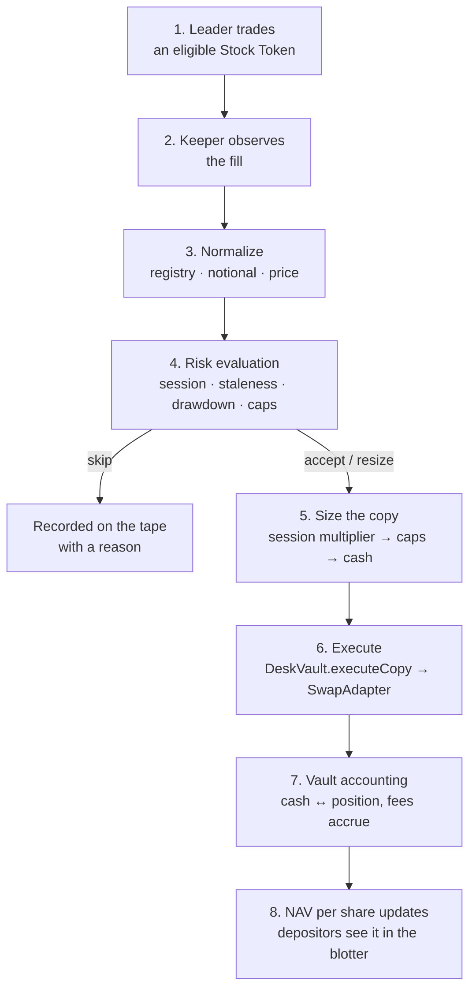

This page walks the full lifecycle of a copy trade, at the level of "what happens" before "how it's coded". Every step links to the deeper reference.

## The lifecycle

### 1. Leader activity

A desk is bound to exactly one **leader** address, fixed at deployment (`DeskVault.leader()`). The leader trades official Stock Tokens on Robinhood Chain with their own money, in their own wallet. The keeper never picks the leader — it reads the binding from the vault (or an explicit operator fallback). See [Leaders & Followers](/docs/concepts/leaders-and-followers).

### 2. Observation

The keeper's **fill source** watches for leader activity. The live source reads ERC-20 `Transfer` logs for registry token addresses and classifies each transfer as a leader buy or sell. A static fixture source exists for paper mode and tests. See [Fill sources](/docs/keeper/fill-sources).

:::callout{type="warning" title="Current limitation"}
The live indexer currently decodes direction (buy/sell) but not notional or price — those fills are rejected downstream as `ZERO_NOTIONAL` until a cited price source is attached. The shipped, exercised path today is the paper/fixture pipeline. This is documented honestly in [Fill sources](/docs/keeper/fill-sources).
:::

### 3. Normalization

The **signaler** turns a raw fill into a copy signal, failing closed: unknown symbol (not in the official registry), zero notional, or a bad price all reject before any risk math runs. See [Pipeline](/docs/keeper/pipeline).

### 4. Risk evaluation

The signal is evaluated twice, with the same rules:

- **Off-chain**, by the keeper's TypeScript port (`evaluateRisk`), so the tape can record *why* before anything is submitted.
- **On-chain**, by `RiskModule.evaluate` inside the same transaction as execution, so the rules are enforced even if the keeper misbehaves.

The checks, in order: desk configured → token allowlisted → session tradable → price fresh → drawdown not breached → size non-zero → session multiplier → per-fill cap → per-position cap → gross exposure cap → (buys) cash available / (sells) position exists. See the [Risk Engine](/docs/risk/overview) section.

### 5. Resize, skip, or halt

Every decision is one of:

| Outcome | Meaning |
|---|---|
| **accept** | Copied at the full computed size |
| **resize** | Copied smaller — capped by fill/position/gross/cash limits or session multiplier |
| **skip** | Not copied; reason recorded (closed session, stale price, cap reached, …) |
| **halt** | Drawdown from the high-water NAV breached the desk limit; new copies stop until review |

### 6. Execution

If the on-chain risk module returns `Accept`, `DeskVault.executeCopy` swaps through the **SwapAdapter** — a restricted adapter that never accepts arbitrary calldata, only calls an owner-set router, and only for allowlisted tokens. On mainnet the router is `ExactInputRouter02`, a thin wrapper over Uniswap's SwapRouter02 `exactInputSingle`. On testnet no router is configured, so execution reverts (fail closed). See [SwapAdapter](/docs/contracts/swap-adapter).

### 7. Vault accounting

A buy moves USDG from `cashUsdg` into a token position; a sell does the reverse. Fees accrue against the high-water mark and time-based AUM on every state-changing call. Positions are valued with `balanceOfUI()` × oracle price. See [NAV & Accounting](/docs/accounting/nav-and-accounting).

### 8. NAV per share

`navPerShare = equity / totalShares`, where equity is cash plus position values minus fee liabilities. Depositors read it in the blotter; the drawdown halt and the performance fee both key off it. See [Seat Shares & NAV](/docs/concepts/seat-shares-and-nav).

## Where each step lives

| Step | Component | Code |
|---|---|---|
| Observe | Keeper fill sources | `keeper/src/indexer.ts` |
| Normalize | Signaler | `keeper/src/signaler.ts` |
| Session clock | Keeper session module | `keeper/src/session.ts` |
| Risk (off-chain) | Keeper executor | `keeper/src/executor.ts` |
| Risk (on-chain) | RiskModule | `contracts/src/RiskModule.sol` |
| Execute | DeskVault + SwapAdapter | `contracts/src/DeskVault.sol`, `contracts/src/SwapAdapter.sol` |
| Accounting | DeskVault + NavLib + FeeModule | `contracts/src/libraries/NavLib.sol`, `contracts/src/FeeModule.sol` |
| Display | App + SDK | `app/`, `sdk/` |
