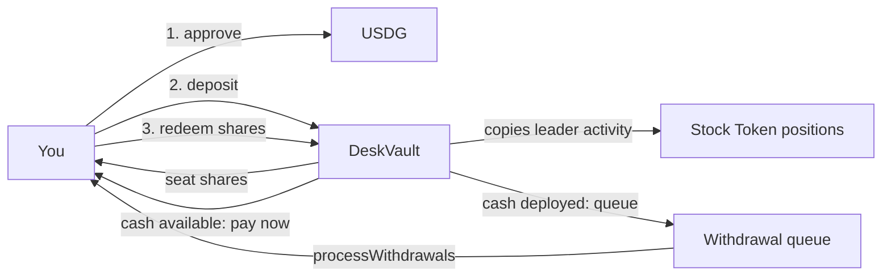

## 1. Obtain USDG

The desk's accounting asset is USDG on Robinhood Chain (6 decimals). Official addresses are listed in [Networks](/docs/networks/overview). SEAT does not sell or bridge USDG; acquiring it is out of the protocol's scope.

## 2. Choose a desk and deposit

In the [blotter](/docs/application/overview), connect a wallet on a chain with a wired vault (`46630` today; `4663` once a capped desk is broadcast). If the factory has multiple desks, a desk picker appears (also addressable via `?desk=<vault>`).

Depositing is two transactions:

1. `USDG.approve(vault, amount)`
2. `DeskVault.deposit(amount)`

The vault accrues fees, checks the **deposit cap** (mainnet: 50,000 USDG of equity after the deposit; testnet: uncapped), mints shares pro-rata to equity (`shares = assets × totalShares / equity`; 1:1 on an empty desk), and takes the USDG. Deposits are blocked while the vault is paused.

## 3. Hold seat shares

Your position is `sharesOf[you] / totalShares` of the desk. The blotter shows your shares, NAV, cash, the leader, and the desk's fill tape. Shares are internal accounting — not a transferable token — so there is nothing to stake, send, or lose in a wallet drain.

## 4. The desk participates in leader activity

While you hold, the desk copies its leader under the risk rules: session-scaled, capped, fail-closed. NAV per share moves with the desk's positions; fees accrue as described in [Fees & High-Water Mark](/docs/concepts/fees-and-high-water-mark). You can watch every decision on the tape — including the copies that were skipped and why.

## 5. Redeem

`DeskVault.redeem(shares)` burns your shares and computes the USDG owed at current NAV per share:

- **Instant:** if the vault is not paused and `cashUsdg` covers the amount, USDG is transferred immediately (`Redeem`).
- **Queued:** otherwise the request is appended to the withdrawal queue (`WithdrawQueued`) with the amount locked in. `processWithdrawals(maxCount)` — callable by anyone, unpaused only — pays queued requests in FIFO order as cash becomes available (e.g. after the desk sells positions).

Redeeming while the vault is **paused** is possible, but always lands in the queue (instant payment requires unpaused).

## 6. What you bear

- Market risk on the desk's Stock Token positions, including gaps and slippage on copies.
- Fee drag: 10% of new profits above the high-water mark plus 2%/yr AUM.
- Queue risk: instant redemption depends on free cash; a fully deployed desk pays out only as positions are sold.
- The protocol risks documented in [Security](/docs/security/security-model) and the [risk disclosure](/docs/runbooks/risk).

