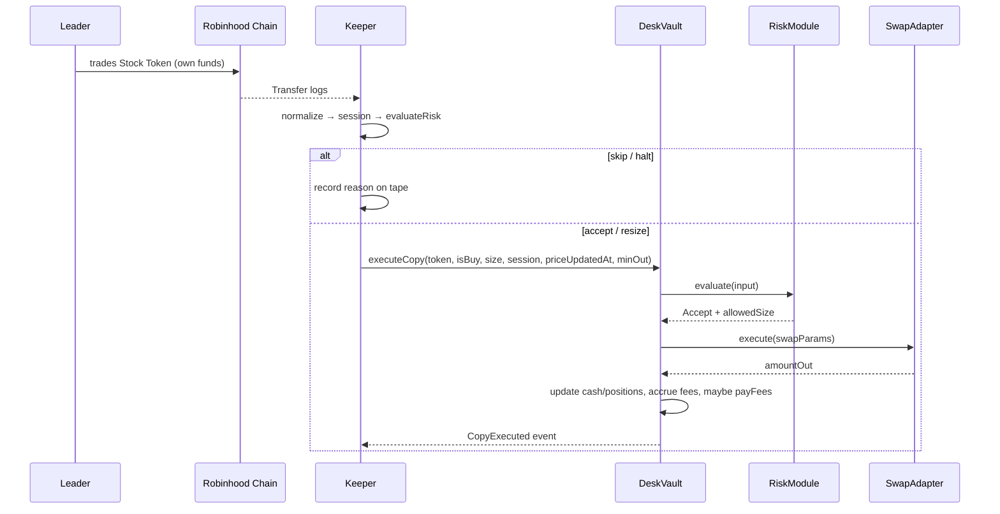

This is the lifecycle of a leader and their desk, as the code implements it today.

## 1. Registration / authorization

There is no self-serve "become a leader" flow in the current phase. A leader exists when a desk is created for their address:

- **Owner path:** the protocol owner calls `DeskFactory.createDesk(leader)` (used by the deploy scripts for `LEADER_ADDRESS`, `LEADER_2`, `LEADER_3`).
- **Bonded path (Phase 2):** anyone calls `DeskFactory.listDesk(leader)` after approving the listing bond (default 100,000 `$SEAT`). The bond is recorded (`bondOf`, `bonderOf`) and is returnable by the owner on sunset via `returnBond`. There is **no slashing** — that is explicitly Phase 3.

Either path deploys a fresh `DeskVault` with the leader's address immutable. One leader, one vault: `createDesk`/`listDesk` revert with `DeskExists` otherwise.

After creation the owner wires the vault: oracle, fee module, fee recipients (the leader address is the default leader payee), deposit cap, keeper, and the desk's risk configuration (`RiskModule.configureDesk` + token allowlist + session multipliers). The mainnet deploy script does all of this with the cited defaults.

## 2. The leader trades

The leader trades official Stock Tokens on Robinhood Chain from their own wallet, with their own funds. Nothing about the leader's wallet changes; no approvals to the vault, no key sharing.

## 3. The keeper observes

The keeper resolves the desk's leader from `vault.leader()` and watches for fills:

- **Live:** `LiveFillSource` scans ERC-20 `Transfer` logs of registry token addresses over a ~2,000-block lookback and classifies transfers to/from the leader as buys/sells. (Current limitation: notional and price are not yet attached, so these fills reject as `ZERO_NOTIONAL` — see [Fill sources](/docs/keeper/fill-sources).)
- **Paper:** `StaticFillSource` feeds fixture fills through the identical pipeline.

## 4. Evaluation

Each fill is normalized (registry symbol, non-zero notional, valid price), timestamped into a market session, and run through the risk rules — first off-chain in the keeper, then again on-chain inside `executeCopy`. Outcomes: accept, resize, skip, or halt, each with a reason recorded to the [fill tape](/docs/keeper/fill-tape).

## 5. Copy sizing

The desk's intended size is `leaderNotional × baseCopyBps × sessionBps`, then clamped by the per-fill cap, per-position headroom, gross-exposure headroom, and available cash. The copy is therefore usually **smaller** than the leader's trade — deliberately.

## 6. Execution

If `RiskModule.evaluate` returns `Accept`, the vault swaps through `SwapAdapter` → `ExactInputRouter02` → Uniswap SwapRouter02 (`exactInputSingle`, pool fee 3000 on the cited 4663 pools), with a keeper-computed `minAmountOut`. The vault's cash and positions update, fees accrue, and `CopyExecuted` is emitted.

## 7. The leader gets paid

Fees accrue against the high-water mark and AUM. When the vault holds enough cash, `_tryPayFees` pays out: **70% of every fee to the leader** (at `leaderFeeRecipient`, defaulting to the leader address), 20% to the protocol, 10% to stakers. The leader's wallet is otherwise untouched by the desk — they never receive a claim on depositor principal.

