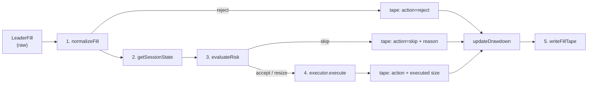

Every fill, fixture or chain, goes through the same five stages (`processFill` in `keeper/src/executor.ts` is the shared implementation).

## Stage 1 — Normalize (`signaler.ts`)

`normalizeFill(fill)` fails closed:

| Check | Reject |
|---|---|
| Symbol in the official registry | `UNKNOWN_SYMBOL` |
| `notionalUsdg > 0` | `ZERO_NOTIONAL` |
| `price > 0` with integer decimals | `BAD_PRICE` |

Output: a `CopySignal` (fill id, leader, symbol, side, leader notional, price, timestamp).

## Stage 2 — Session (`session.ts`)

`getSessionState(date)` resolves the America/New_York wall clock into `closed | pre_market | regular | after_hours` with a size multiplier (0 / 3000 / 10000 / 3000 bps by default) and a `tradable` flag. Undeterminable clock ⇒ closed. See [Market sessions](/docs/concepts/market-sessions).

## Stage 3 — Risk (`executor.ts` → `evaluateRisk`)

Order: halted? → tradable session? → price known and fresh? → base sizing (`leaderNotional × baseCopyBps × sessionBps`) → per-fill cap → position cap (buys) → gross cap (buys) → cash clamp (buys) / position clamp (sells). Returns `{ action: accept | resize | skip, sizeUsdg, intendedUsdg, reason }`.

## Stage 4 — Execute

- **Paper:** `PaperExecutor` converts the size to tokens at a slippage-adjusted price (buys pay more, sells receive less) and mutates the in-memory desk state (cash, positions).
- **Live:** `LiveExecutor.submitCopy` → `submitExecuteCopy`, which re-checks every guard before encoding `executeCopy` calldata. See [Execution modes](/docs/keeper/execution-modes).

## Stage 5 — Record (`fills.ts`)

`recordOutcome` flattens the outcome (id, symbol, side, action, reason, session, intended/executed sizes, NAV after, halted flag) plus context (desk, leader, slippage, `source=fixture|chain`, timestamp). `writeFillTape` overwrites `keeper/data/fills.json` with the run's outcomes.

After each fill, `updateDrawdown` recomputes NAV per share, raises the high-water mark, and latches `halted` if the drawdown threshold is breached — subsequent fills in the same run then short-circuit to `skip`.

## Worked example

`make paper` processes five fixture fills through this pipeline: a regular-hours NVDA buy (accepted), an oversized NVDA buy (resized by the per-fill cap), an after-hours AAPL buy (30% sizing), a weekend SPY buy (skipped — session closed), and an unknown-symbol fill (rejected at normalize). Each line of the output shows session, action, intended vs executed size, and the reason.
