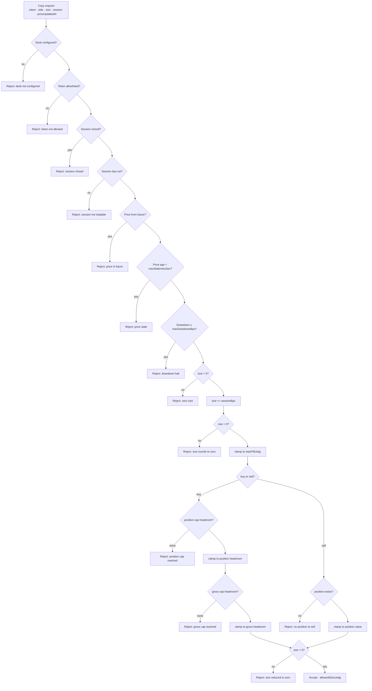

## The flow

## Reading the tape

The keeper records the same decision in its own vocabulary:

| Tape action | Meaning | Example reason |
|---|---|---|
| `accept` | Full intended size | `accepted at full size` |
| `resize` | Capped/clamped | `accepted with size reduced by caps` |
| `skip` | Rule rejection | `session closed not tradable`, `price stale (181s > 120s)`, `position cap reached for NVDA`, … |
| `reject` | Failed normalization (before risk) | `UNKNOWN_SYMBOL: …`, `ZERO_NOTIONAL: …`, `BAD_PRICE: …` |
| `halted: true` | Drawdown halt active | `desk halted by drawdown protection` |

## Drawdown halt mechanics

- The desk's high-water mark is the highest NAV/share ever reached (updated on deposits and copies).
- Drawdown in bps: `(hwm − navPerShare) × 10_000 / hwm`.
- At or above `maxDrawdownBps` (default 2,000 = 20%), evaluation rejects with `drawdown halt` — **new copies stop**. Redemptions are unaffected.
- The keeper latches its own `halted` flag (`updateDrawdown`) so subsequent paper/live evaluations short-circuit.
- There is no automatic un-halt: the halt clears only when NAV per share recovers enough that the drawdown is again below the threshold (on-chain, evaluation is stateless), or after operator review of the configuration.

## A fully worked rejection

Example numbers — not a live desk or forecast. A 60,000 USDG leader buy of NVDA in regular hours, desk at 5% copy fraction:

1. Intended: `60,000 × 5% × 100% = 3,000 USDG`
2. Per-fill cap 2,000 (keeper config) → **resize** to 2,000
3. Current NVDA position value 4,500; position cap 5,000 → headroom 500 → **resize** to 500
4. Gross exposure 9,800; gross cap 10,000 → headroom 200 → **resize** to 200
5. Cash 10,000 → no further clamp
6. Decision: `resize`, executed 200 USDG, reason `accepted with size reduced by caps`

The same input on-chain yields `(Accept, 200e6, "accepted")` with the on-chain caps substituted.
